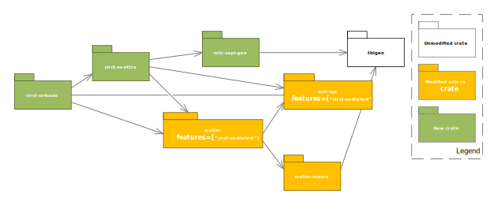

# Exploring Rust with MLIR and CIRCT, Summer 2025
Jack Greenbaum \<jack@greenbaum.org\>

MLIR (mlir.llvm.org) stands for "Multi-Level Intermediate Representation". It builds on the ideas of
LLVM, but with a larger scope. LLVM is focused on lowering to processor instructions. MLIR's
"dialects" allow the definition of multiple levels of IR, of which LLVM is just one. MLIR is
commonly used in AI stacks because it allows for representing data flows more explicitly than a
programming language like C++ or Python can, leading to higher performance code generation for
parallel computing hardware like GPUs and NPUs. It is also higher level and multilevel as compared
to LLVM, again increasing the ability of designers to express intent to lower tools. See
<https://ieeexplore.ieee.org/abstract/document/9222299/> as one resource for a deeper discussion of
AI stacks and how MLIR fits in.

My interest in MLIR is writing EDA code in Rust using the [CIRCT Project](circt.llvm.org) dialects.
Like LLVM, MLIR is written in C++. A subset of the MLIR C++ API is available through a C API that
enables other language bindings. The rest of this report describes my experience using the current
Rust bindings to MLIR, and work I've done to extend the MLIR C API to enable use of more MLIR
dialects with Rust than possible before.

# Rust and MLIR: The Melior Crate

 The [`melior`](https://crates.io/crates/melior) Rust language "crate" provides a Rust interface to
the MLIR. `melior` uses the [`mlir-sys`](https://crates.io/crates/mlir-sys) crate which provides the
Rust FFI bindings to the [MLIR C API](https://mlir.llvm.org/docs/CAPI/). `melior` has "handwritten"
Rust bindings for some basic MLIR dialects like `func`, `cf`, `arith` and `llvm` (function
operators, control flow operators, arithmetic operators, and the LLVM dialect respectively), as well
as covering other dialects by generating Rust code based on the dialect's ODS specification of
operations.

Here is some idiomatic code from the melior README.md showing typical Rust code using `melior`. In
this code an MLIR block of operations is created, and two operations are appended to it:
```
let block = Block::new(&[(index_type, location),(index_type, location)]);
let sum = block.append_operation(arith::addi(
                block.argument(0).unwrap().into(),
                block.argument(1).unwrap().into(),
                location)
            )
            .result(0)
            .unwrap();
block.append_operation(func::r#return(&\[sum.into()\], location));
```

The variables `index_type` and `location` contain an MLIR Type and Location objects respectively.
These Rust types contain the underlying raw MLIR C API types for these objects, which themselves are
just opaque raw pointers to C++ objects. Not only do the types map directory to C API types, all of
the functions invoked also are C API functions, like the Rust statement
`block.append_operation(...)` which maps to the C function `mlirBlockAppendOperation()` which calls
the C++ member function `Block::appendOperation` on the wrapped pointer to the `Block`. As you can
see `melior` is a thin layer on top of the MLIR C API, as its
[README.md](https://github.com/mlir-rs/melior/blob/main/README.md) states.

One of the powers of MLIR is the ODS or [Operator Definition
Specification](https://mlir.llvm.org/docs/DefiningDialects/Operations). ODS uses the LLVM [Table Gen
language](https://llvm.org/docs/TableGen/index.html) to specify new MLIR dialects and their
operations, attributes, and types. Many dialects do not define new attributes or types beyond the
MLIR builtin attributes and types, only operations. `melior` provides all you need for these
operator only dialects. An example is the MLIR
[`arith`](https://mlir.llvm.org/docs/Dialects/ArithOps) dialect which uses only builtin attributes.
But when I tried something more exotic, like the CIRCT project dialects for EDA, I hit limitations
in `melior`, that are really limitations in the MLIR C API.

`melior` itself depends on the `mlir-sys` crate and the MLIR C API to expose the required MLIR C++
functionality. Today the MLIR C API is handwritten code provided with MLIR, and the scope varies
from dialect to dialect. What I found while trying to add CIRCT dialects to `melior` is that most of
the CIRCT dialects do not have all or even many of their dialect defined attribute or type objects
exposed over the C API. An example of a CIRCT dialect with good C API support is the
[`hw`](https://circt.llvm.org/docs/Dialects/HW/), or "hardware module" dialect. Just by adding a new
ODS dialect to melior with a macro, and including the CIRCT MLIR C API headers in `mlir-sys`, I was
able to create a CIRCT hw dialect module operation:

```
// Create the module
let sym_name = StringAttribute::new(&ctx, "test1");
let mod_ports = [
    mlir_sys::HWModulePort {
        name: StringAttribute::new(&ctx, "arg0").to_raw(),
        type_: i1_type.clone().to_raw(),
        dir: mlir_sys::HWModulePortDirection_Input
    },
    mlir_sys::HWModulePort {
        name: StringAttribute::new(&ctx, "arg1").to_raw(),
        type_: i1_type.to_raw(),
        dir: mlir_sys::HWModulePortDirection_Input
    },
    mlir_sys::HWModulePort {
        name: StringAttribute::new(&ctx, "arg8").to_raw(),
        type_: i8_type.to_raw(),
        dir: mlir_sys::HWModulePortDirection_Input
    }
];

let module_type = TypeAttribute::new(unsafe {
    Type::from_raw(mlir_sys::hwModuleTypeGet(ctx.to_raw(),
    mod_ports.len() as isize,
    std::mem::transmute(&mod_ports)))
});

let parameters = ArrayAttribute::new(&ctx, &[]);
let module = hw::module(&ctx,
                        body_region,
                        sym_name,
                        module_type,
                        parameters,
                        here!(ctx));
```

The first line creates a `melior::ir::attribute::StringAttribute`, a Rust object which wraps an
mlir::StringAttr C++ object in an MLIR C API Attribute opaque object. The next two statements create
an `mlir::TypeAttr` C++ object from an Rust `mlir::dialect::hw:ModuleType` object, which itself is
created from an array of MLIR C API `HWModulePort` structs exposed via `mlir_sys`. `melior` isn't in
the picture through the call to `mlir_sys::hwModuleTypeGet`, access to the hw dialect attributes is
through the `mlir-sys` exposed MLIR C API exclusively.

# Beyond the Existing MLIR C API

What melior provides is fine when the dialect's attributes have a C API, as shown above with the
CIRCT `hw` dialect. But what if a dialect doesn't have a C API for its attributes? `melior`
generates operation creation code for MLIR dialects defined using the MLIR ODS with TableGen files.
`melior` uses [`tblgen-rs`](https://crates.io/crates/tblgen) to generate builders for operators, but
doesn't do anything for ODS attributes today. With my interest in writing EDA code in Rust using the
CIRCT dialects, I naturally looked at the [`sv`](https://circt.llvm.org/docs/Dialects/SV)
(SystemVerilog) dialect. That's when I ran out of steam with the existing MLIR C API. In one
experiment I tried to generate the `sv` dialect
[`basic.mlir`](https://github.com/llvm/circt/blob/main/test/Dialect/SV/basic.mlir) test file using
`melior` APIs. This worked until I hit an operation with an `sv` dialect defined attribute. This
first came up with the `sv.ifdef.procedural` operation. It takes an `sv::MacroIdentAttr` as the
condition, and at least at the time of this writing there was no MLIR C API that covered that
attribute.

Like any curious engineer, this is when I jumped down the rabbit hole of generating the MLIR C API
for ODS dialect attributes in Rust with `tblgen-rs`. What better way to learn about the details of
MLIR? In the end I modified `melior` and `mlir-sys` with a set of `circt-XX-dialect` features, one
for each dialect. The `circt-sv-dialect` feature depends on the related dialects like
`circt-hw-dialect`. For `mlir-sys`, this feature causes the include file for the MLIR C API for
CIRCT dialects as it exists today to be included in `mlir-sys`. In `melior`, the `circt-XX-dialect`
features use `melior-macro` to add the dialect to `melior` as an ODS dialect. From `melior` we get
operation builders for the dialect operations and basic MLIR IR Rust objects. Then I authored a set
of crates to generate the basic MLIR C API calls for creating dialect attributes and accessing their
parameters, along with an associated Rust FFI layer. Here is a diagram showing the dependencies
between all the crates:



I already discussed the `melior` and `mlir-sys` `circt-XX-dialect` features above. `melior-macro` is
modified to fix an incorrect use of type inferencing that shows up with the CIRCT dialects. My
`mlir-capi-gen` can be used in a build.rs file to generate the MLIR C API for a dialect's
attributes. `circt-sv-attrs` is one such crate, which uses a `build.rs` and `.json` file to
configure what dialects have code generated by `mlir-capi-gen`. Finally, there is a demo application
crate `circt-sv-basic` that uses `melior`, `mlir-sys`, and the generated attribute code from
`circt-sv-attrs` to output MLIR assembly equivalent to the beginning of the basic.mlir test. 

Here is some code from `circt-sv-basic` that creates an `sv::MacroIdentAttr` from `mlir-capi-gen`
generated Rust FFI and C code and uses it to create an `sv::ifdef_procedural` operation:

```
let macro_ident = StringAttribute::new(&ctx, "SYNTHESIS");
let macro_ref = unsafe {
    Attribute::from_raw(svMacroIdentAttrGetAlt2(macro_ident.to_raw()))
};

let ifdef_op = sv::ifdef_procedural(&ctx,if_region, else_region, macro_ref.into(), here!(ctx));
```

An `sv::MacroIdentAttr C++` object is created using one of the C API builders generated by
`mlir-capi-gen`, and it gets wrapped in an `melior::ir::Attribute` Rust object. Finally, we call the
`melior-macro` generated `sv::ifdef_procedural` builder to create the `sv.ifdef.procedural` MLIR
operator. 

Here are links to all the crate sources:
-   * `melior`/`melior-macro` patches:
    <https://github.com/jgreenbaum/melior/commit/dc22a3d5f7bf20acd53fef2c9aa8abbb2e6a8811>
-   * `mlir-sys` patches:
    <https://github.com/jgreenbaum/mlir-sys/commit/66217bda482c59c2c3b89060476d7751dff6c9f5>
-   * `mlir-capi-gen` crate:
    <https://github.com/jgreenbaum/mlir-capi-gen>
-   * `circt-sv-attrs` crate:
    <https://github.com/jgreenbaum/circt-sv-attrs>
-   * `circt-sv-basic` crate:
    <https://github.com/jgreenbaum/circt-sv-basic>

# Further Work

After posting some questions on the LLVM discussion boards, I was 
[encouraged](https://discourse.llvm.org/t/dialect-attributes-in-mlir-c-api/87800/12?u=jegree) to 
port my Rust `mlir-capi-gen` capability into MLIR's C++ `mlir-tblgen` utility. This should be
straightforward since both use the same TableGen data bases as in input, and the Rust and C++ calls
have the same names and arguments (via `tblgen-rs` excellent C API).

For my interest in EDA code in Rust, I expect to build on my work with the `sv` dialect and write
some generators of interest. Not only does Rust have the memory safety that C++ does not, leading to
higher quality code, but I also want to leverage Rust's `procmacro` capability to make writing
generators easier by mixing procedural and declarative code while maintaining excellent error
reporting. If you have an interest in Rust in EDA, or Rust with MLIR, please reach out.